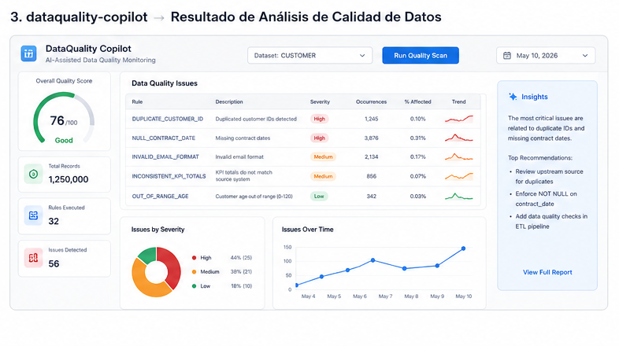
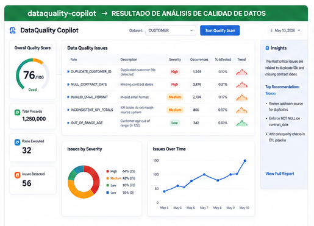
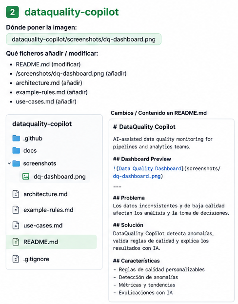

# DataQuality Copilot

AI-assisted data quality monitoring for modern data pipelines.

---

## Dashboard Preview





---

## Rules & Quality Overview



---


## Problem

Many business dashboards fail silently because of poor data quality.

Common problems:

- duplicated rows
- null values
- broken joins
- inconsistent KPIs
- invalid dates
- silent ETL failures

## What DataQuality Copilot does

DataQuality Copilot profiles datasets, detects quality issues and generates business-friendly explanations.

## Current concept features

- Duplicate detection
- Null analysis
- Anomaly detection
- dbt test generation
- Data profiling
- Executive quality report

## Example output

```text
Table: SALES_ORDERS

Issues detected:
- 12% duplicated ORDER_ID
- 8% NULL CUSTOMER_ID
- Negative revenue values detected

Business impact:
Dashboards may show incorrect revenue and customer metrics.

Suggested actions:
- Add uniqueness test
- Validate joins
- Review ingestion process
```

## Architecture

```text
CSV / Database / Warehouse
        ↓
Profiling Engine
        ↓
Quality Rules
        ↓
Anomaly Detection
        ↓
AI Explanation Layer
        ↓
Executive Report
```
---

## Documentation

See:
- example-rules.md
- architecture.md
- use-cases.md

---

## Roadmap

- CSV profiler
- PostgreSQL connector
- Snowflake connector
- dbt test generator
- HTML reports
- Alerts integration# dataquality-copilot
AI-assisted data quality monitoring for pipelines and analytics teams.
